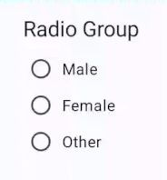

# RadioGroup

RadioGroup composable displays a title and multiple RadioButtons, one for each of the option from list of options passed. 



There are two ways to use the RadioGroup :

### 1. Pass the MutableState directly

```kotlin
@Composable
fun RadioGroup(
    modifier: Modifier = Modifier,
    title: String? = null,
    state: MutableState<String?>,
    options: List<String>
)
```

Example :

```kotlin
val gender = remember { mutableStateOf<String?>(null) }

RadioGroup(
    title = "Radio Group",
    state = gender,
    options = listOf("Male", "Female", "Other")
)
```

### 2. Control the MutableState yourself

```kotlin
@Composable
fun RadioGroup(
    modifier: Modifier = Modifier,
    title: String? = null,
    selection: String?,
    onSelectionChange: (String) -> Unit,
    options: List<String>
)
```

Example :

```kotlin
val gender by remember { mutableStateOf<String?>(null) }

RadioGroup(
    title = "Radio Group",
    selection = gender,
    onSelectionChange = { gender = it },
    options = listOf("Male", "Female", "Other")
)
```

### LabelledRadioButton

RadioGroup uses LabelledRadioButton internally. The RadioButton provided by Material library is plain, without any label. But LabelledRadioButton displays and handle clicks while displaying a label alongside the RadioButton. 


You can use it to build your own custom RadioGroup :

```kotlin
@Composable
fun LabelledRadioButton(
    label: String,
    selected: Boolean,
    textStyle: TextStyle = MaterialTheme.typography.bodyLarge,
    whiteTint: Boolean = false,
    color: Color = Color.Black,
    onClick: () -> Unit
)
```

Example :

```kotlin
val gender by remember { mutableStateOf<String?>(null) }

LabelledRadioButton(
    label = "Male",
    selected = gender == "Male",
    onClick = { gender = "Male" }
)
```
